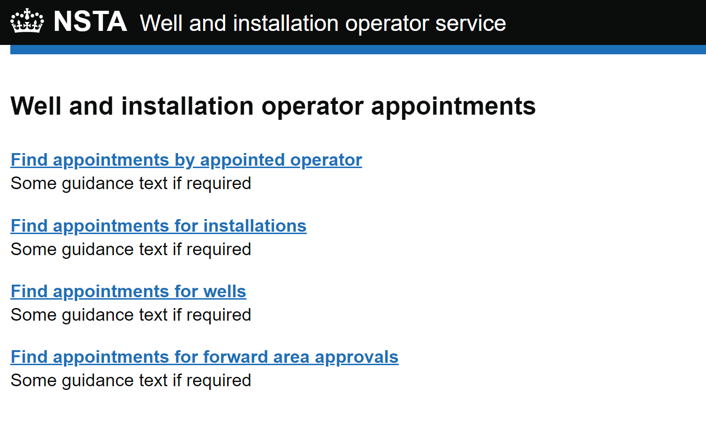

## OSDOP-254: Searching the system of record

* Status: DRAFT
* Approved by:

### Problem statement

We have requirements to search for wellbore, installation and subarea forward approval appointments using a variety 
of search criteria. Some search criteria is for all asset types whereas others are specific to one type. It has already 
been decided that there will be four different search screens the user can go to depending on what they want to search
for. Each search page will use the [FDS search pattern](https://design-system.fivium.co.uk/patterns/search) with a 
different set of applicable filters.

We need to determine how we are going support the different query requirements and how we will populate and display
the search results.

Users will be able to access the different search pages from a central landing page:



### Solution

#### Querying

Each search page will be returning appointments for assets. Regardless of the type of asset being searched for, the
data model is the same and only the predicates to apply will be different.

The distinct current predicates we need to apply are:
- only active appointments should be returned (e.g appoints without an end date)
- appointed operator of asset
- wellbore
- installation
- subarea
- type of nomination (e.g. `DEEMED`)

In order to search by operator, wellbore, installation or subarea you would need to select an exact value from a 
search selector searching over EPA data. No partial searching will be available.

We would have to include an asset type restriction to cater for scenarios where if we are on the "Find appointments
for wells" search and only search for the appointed operator we want to only return wellbores and not 
installations or subareas.

The JOOQ query will be the below:

```java
class AppointmentQueryService() {

  List<AppointmentResultItemDto> searchAppointments(AppointmentSearchForm appointmentSearchForm,
                                                    Set<AssetType> assetTypeRestrictions) {
    return context
      .select(
        field("assets.portal_asset_id"),
        field("assets.portal_asset_type"),
        field("appointments.appointed_portal_operator_id"),
        field("appointments.type")
      )
      .from(table("assets"))
      .join(table("appointments"))
        .on(field("appointments.asset_id").eq(field("assets.id")))
      .where(getPredicateConditions(appointmentSearchForm, assetTypeRestrictions))
      .fetchInto(AppointmentResultItemDto.class);
  }

  private List<Condition> getPredicateConditions(AppointmentSearchForm appointmentSearchForm,
                                                 Set<AssetType> assetTypeRestrictions) {

    List<Condition> predicateList = new ArrayList<>();

    // current appointments only
    predicateList.add(field("appointments.responsible_to_date").isNull());

    // add predicate for asset type restriction

    // if operator filter provided from input form then add predicate
    if (StringUtils.isNotBlank(appointmentSearchForm.getAppointedOperatorId())) {
      predicateList.add(
        field("appointments.appointed_portal_operator_id")
          .eq(Integer.parseInt(appointmentSearchForm.getAppointedOperatorId()))
      );
    }

    // if wellbore filter provided from input form then add predicate

    // if installation filter provided from input form then add predicate

    // if subarea filter provided from input form then add predicate

    // if appointment type filter provided from input form then add predicate

    return predicateList;
  }
}
```

Having a single simple query with dynamic predicates will mean we only have to maintain and test one query. There was
some potential concerns about the query becoming complex with a large number of predicates but as distinct number of
predicates is small I don't think it warrants separate queries and the maintenance overhead that would bring.

#### Getting the names of the assets from the Energy Portal

As WIOS will only have the IDs of the assets from the Energy Portal we will need to call EPA to be able to get the 
installation name, wellbore registration numbers and subarea names to display.

After running the query above would get back a list of assets and their IDs. For each distinct asset type returned we 
would extract all the IDs for that asset type and make one request to EPAs search by ID method for that type. 
We would then create a list of objects which has the name of the asset as well as the values we want to display.

It is possible with subareas and wellbores that we could have an appointment for an asset whose ID no longer returns 
a value from EPA. If we have cases like this we just wouldn't show the asset in the search results even though there
is an appointment in WIOS.

#### Searching for assets with no active appointments or not know to WIOS

The "Find appointments for installations", "Find appointments for wells" and "Find appointments for subareas" search
screens will have search selectors searching over the live EPA datasets. It could very likely be the case that WIOS 
doesn't have an active appointment for a given asset or has never had an appointment for the asset.

If the user is searching for a specific wellbore that WIOS doesn't have an appointment for and no other search filters
are provided, the SoR search should still return a result for that asset. We can achieve this feature by running the 
search query to attempt to find a matching appointment. If no rows are returned when we have entered either a wellbore, 
installation or subarea ID and no other filters, then we will manually construct an item and add it to the result list.

```java
class AppointmentSearchService {
  
  List<AppointmentResultItem> getAppointments(AppointmentSearchForm appointmentSearchForm,
                                              Set<AssetType> assetTypeRestrictions) {
    
    List<AppointmentResultItemDto> appointments = appointmentQueryService.searchAppointments(
        appointmentSearchForm, 
        assetTypeRestrictions
    );
    
    if (!appointments.isEmpty()) {
      // 1. extract IDs for each asset type and call EPA APIs to get names of assets
      // 2. stream list and convert to AppointmentResultItem for return to controllers
    } else if (appointments.isEmpty() /* and the search form only has a wellbore ID provided */) {
      // construct a AppointmentResultItem for the wellbore that has been selected
      // with an "Appointed operator" data item with value "No well operator"
    } else if (appointments.isEmpty() /* and the search form only has an installation ID provided */) {
      // construct a AppointmentResultItem for the installation that has been selected
      // with an "Appointed operator" data item with value "No installation operator"
    } else if (appointments.isEmpty() /* and the search form only has a subarea ID provided */) {
      // construct a AppointmentResultItem for the subarea that has been selected
      // with an "Appointed operator" data item with value "No forward approval operator"
    }    
  } 
}
```

#### Link to asset timeline

Regardless of the type of asset being returned, the link from the search result will take the user to the appointment
timeline for that asset. This will show all the appointments that have ever been recorded for this asset.

The URL the result items contain will need to contain the ID of the asset e.g. `/wellbore/1234` in
order to cater to still work for assets which have never had an appointment in WIOS. This would allow us to call the 
correct EPA API to get the details about the asset. Slight downside in that we are exposing an ID of an asset 
but this is probably not the end of the world. Even though subareas have a string ID we will still use the ID in the 
URL to be consistent. Equally, if EPA ever changes the string ID we won't have to update anything here.

Having the asset type also in the URL would allow us to customise how each asset timeline looks if needed as we will
have specific endpoints and hence specific model and views if needed without the need for conditional logic if the 
asset type was a query param.

If a user direct entries one of these routes and we don't get a result back from EPA we would show a 404 page.

#### Rendering appointments

I suggest we take a similar approach to the work area, whereby we populate a `AppointmentResultItemModelProperties` 
class which simply wraps a `Map` of model and view properties. Currently, the designs have all assets showing the same
three data items (Appointed operator, appointment date and type of appointment) which means each asset can use the same
`AppointmentResultItemModelProperties`. With this approach if we ever want assets to show different data items we would
have the flexibility without needing to refactor the code.

```java
public record AppointmentResultItem(
    AppointmentResultItemType type, // wellbore, installation, subarea
    String headingText,
    String captionText,
    String actionUrl,
    AppointmentResultItemModelProperties modelProperties
) {}
```