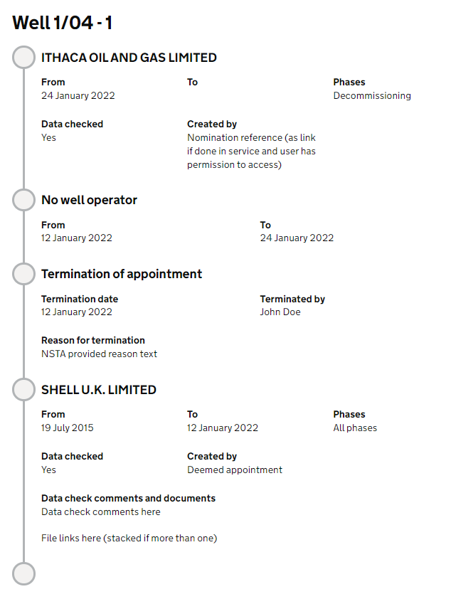

## OSDOP-435: Terminate a system of record appointment

* Status: APPROVED
* Approved by: Danny Betts, Cade Ayres

### Problem statement

We have a requirement to be able to terminate an appointment on the System of Record (SoR). 
Appointments can only be terminated by the NSTA and will be shown on the appointment timeline as
part of the SoR. The reason for termination and any files uploaded will likely only be shown on
the SoR when logged in the NSTA or consultee users.

The scope of this ADR is to review what the model for terminations will look like and how they 
will be shown on the SoR with regular appointments.

### Solution

#### Data model

There will be a single table which will capture the termination information. This will be linked
to the appointment ID that was terminated.

```sql
|_______________TERMINATIONS________________|
| id: UUID PRIMARY KEY NOT NULL             |
| terminated_appointment_id: UUID NOT NULL  |
| reason_for_termination: TEXT NOT NULL     |
| termination_date: DATE NOT NULL           |
| terminated_by_wua_id: INT NOT NULL        |
```

If files are required they will be added to the existing files model which will not require any
additional tables.

#### Displaying on the System of Record

Terminations will display on the system of record alongside other appointments as shown below:



The current system of record displays a list of `AppointmentView` objects for a given asset. These `AppointmentView` 
objects only support appointments and are not easily extended. As terminations and possibly no operator periods are
very different in terms of the display requirements we will need a slight refactor of these objects.

I propose a similar pattern to the work area whereby we have a `AssetEventItem` which has the base properties all
events to show on the timeline have with an additional model properties map. This will require a refactor of how the 
current appointments are shown but will support termination and other event types in the future.

```java
public record AssetEventItem(
    AssetEventType eventType,
    String headingText,
    Instant eventCreationDate,
    AssetEventItemModelProperties modelProperties
) {
}
```

This will allow us to create these objects independently for appointments and for terminations (and anything else) and
still return a `List<AssetEventItem>` to the controller. As all event items will have an event creation
date, we can sort the events regardless of type simply by the creation date.

```java
class AssetEventItemService {

  Optional<AssetEventHistory> getAssetEventHistory(PortalAssetId portalAssetId, PortalAssetType portalAssetType) {
    
    // other code not shown for brevity

    List<AssetEventItem> assetEventItems = new ArrayList<>();

    // get all the appointment events
    assetEventItems.addAll(assetAppointmentEventService.getAppointmentEventItems(asset));

    // get all the termination events
    assetEventItems.addAll(assetTerminationEventService.getTerminationEventItems(asset));

    // sort all events in reverse order
    assetEventItems = assetEventItems
        .stream()
        .sorted(Comparator.comparing(AssetEventItem::eventDate).reversed())
        .toList();
    
    return Optional.of(new AssetEventHistory(assetName, assetEventItems));
  }
}
```

Similar to the work area, the template would change to check the type of event and call an appropriate macro.

```html
<@fdsTimeline.timeline>
  <@fdsTimeline.timelineSection>
    <#list events as event>
      <@fdsTimeline.timelineTimeStamp
        timeStampHeading=event.headingText()
        nodeNumber=""
      >
        <#if event.eventType() == "APPOINTMENT">
          <@_appointmentEvent event=event />
        <#elseif event.eventType() == "TERMINATION">
          <@_terminationEvent event=event />
        </#if>
      </@fdsTimeline.timelineTimeStamp>
    </#list>
  </@fdsTimeline.timelineSection>
</@fdsTimeline.timeline>
```

This gives us complete control over the front end logic for each event type without the need for complex
logic or objects with need to support multiple use cases. This was worked well on the work area and on case events.

#### Terminating the appointment

When an appointment is terminated the outcome will simply be for the `appointments.responsible_to_date` column for the
appointment in question being set with the termination date.

We could additional add a new column to the `appointments` table which could indicate how an appointment was ended,
`SUBSEQUENT_APPOINTMENT`, `TERMINATION`, `CORRECTION`.

### Other options considered

#### Write termination data to appointment table

We could add the reason for termination, terminated by user straight to the appointment table as new columns against
the appointment. We could easily retrieve all appointments for an asset with one query. The reason this wasn't chosen 
was that most appointments would never have these columns populated and these new properties would have to be reflected
in the appointment objects. We would still need additional logic to construct a different object to present on the 
frontend as the display requirements are very different. This also doesn't scale well if lots more data capture fields
are required.
