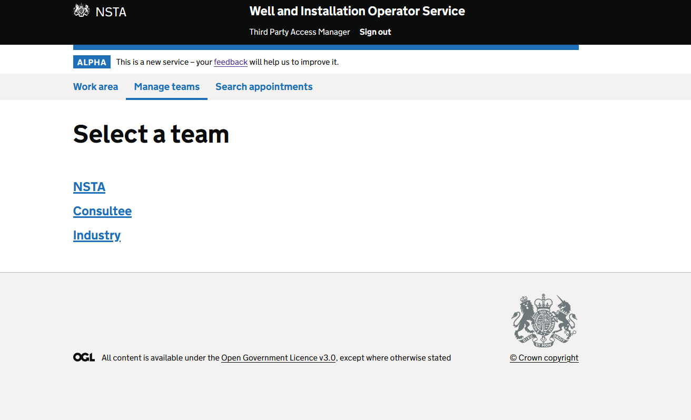

## OSDOP-181

* Status: APPROVED
* Approved by: Dan Ashworth, Matt Eason, Ed Scull

### Problem statement

As there are expected to be a large number of operators, our team selection screen needs to be able to support a large 
quantity of teams.

We need to determine the best approach for scalability with an undetermined amount of teams.

Ideally this would be able to support functionality such as pagination in the future.

### Solution

_See [Slack thread](https://fivium.slack.com/archives/C817PRELX/p1687876837691329) for context_

After further discussion an alternative solution similar to option 2 has been decided.

This will become an accepted pattern for team management screens.

The team type selection screen will change to match the following mockup:


This has the following:

- Lack of row count
- No grouping
- No border between entries

Upon clicking one of these entries, assuming more than one team of the type, then the user will be
directed to a new screen to select the team they would like to view/manage.

This page will look similar:


with the following differences from the team type selection screen:

- Row count
- Border below row count

**Notes:** 
- Both of these designs will use the `resultList` component in FDS. 
- FDS enhancements are required to support this screen design
  1. Result list items without borders if no caption is provided
  2. No border at the top if no count/text is provided

### Considered options

#### Option 1: Keep as is

_Positives_

- No code change required

_Negatives_

- Doesn't scale well

#### Option 2: Copy FCS team selection design

By switching to the FCS design we improve the scalability of the team selection screen by allowing pagination.

It works similar to our current pattern but removes the group headings and places them as captions on the result list items.

Our team selection page code would change from:
```html
    <#list teamGroupMap as teamType,teams>
        <h2 class="govuk-heading-l">${teamType.displayText}</h2>
        <div class="govuk-!-margin-bottom-6">
            <@fdsLinkList.linkList>
                <#list teams as team>
                    <@fdsLinkList.linkListItem
                        linkName=team.displayName()
                        linkUrl=team.teamUrl()
                    />
                </#list>
            </@fdsLinkList.linkList>
        </div>
    </#list>
```
to
```html
  <@fdsResultList.resultList resultCount=teams?size resultCountSuffix="team">
    <#list teams as team>
      <@fdsResultList.resultListItem
        captionHeadingText=team.teamType().getDisplayText()
        linkHeadingUrl=springUrl(team.teamUrl())
        linkHeadingText=team.displayName()/>
    </#list>
  </@fdsResultList.resultList>
```

with a simplifying change in the TeamListController from:
```java
  @GetMapping("/teams")
  public ModelAndView renderTeamList() {
    var teams = teamService.getUserAccessibleTeams(userDetailService.getUserDetail());
    var teamViews = teamManagementService.teamsToTeamViews(teams);

    var teamViewMap = teamViews.stream()
        .collect(Collectors.groupingBy(TeamView::teamType))
        .entrySet()
        .stream()
        .sorted(Comparator.comparing(entry -> entry.getKey().getDisplayOrder()))
        .collect(StreamUtil.toLinkedHashMap(Map.Entry::getKey, Map.Entry::getValue));

    return new ModelAndView("osd/permissionmanagement/teamSelectionPage")
        .addObject("pageTitle", "Select a team")
        .addObject("teamGroupMap", teamViewMap);
  }
```
to
```java
  @GetMapping("/teams")
  public ModelAndView renderTeamList() {
    var teams = teamService.getUserAccessibleTeams(userDetailService.getUserDetail());
    var teamViews = teamManagementService.teamsToTeamViews(teams);

    return new ModelAndView("osd/permissionmanagement/teamSelectionPage")
        .addObject("pageTitle", "Select a team")
        .addObject("teams", teamViews);
  }
```

_Positives_

- Minimal changes
- Ability to paginate results
- Could be turned into a search screen at a later date

_Negatives_
- Not as easy to identify different team types at a quick glance
	- Mitigated as teams would be in team type order.